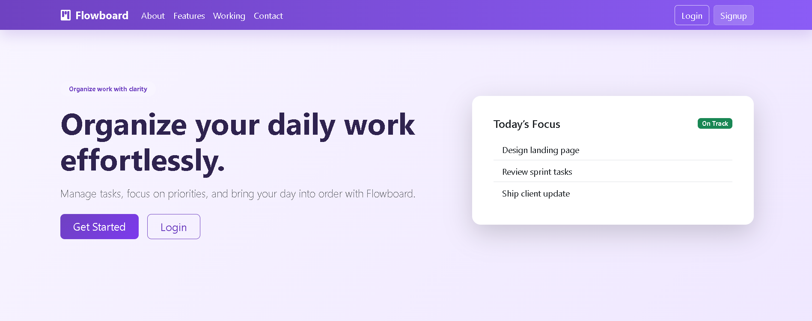
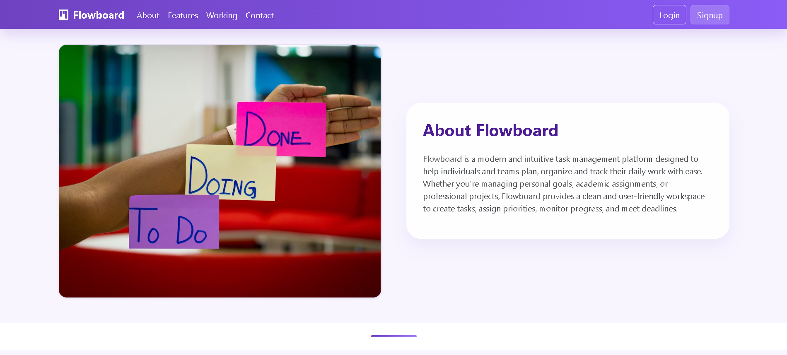
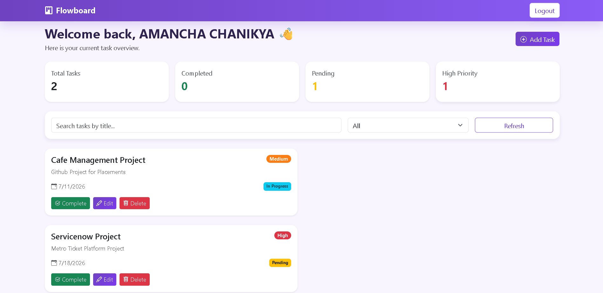
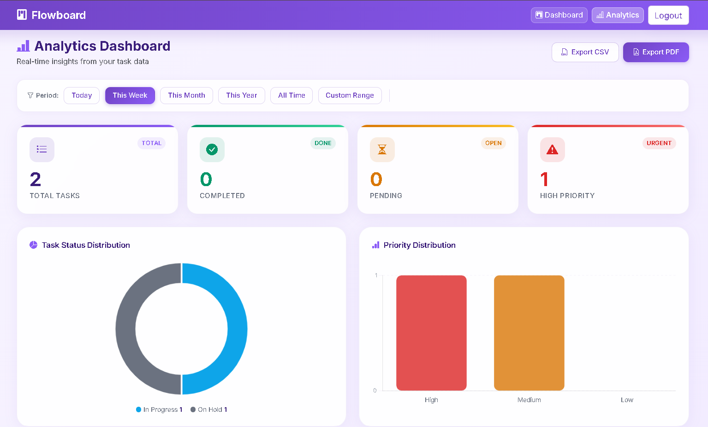
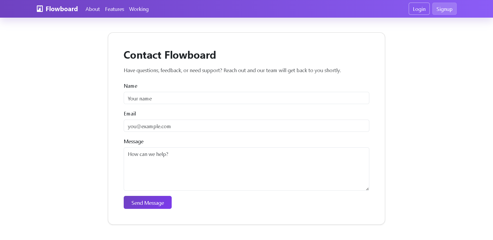

# 🚀 FlowBoard – Smart Task Management System

## 📖 About

FlowBoard is designed to simplify task management for individuals and teams by providing an easy-to-use platform for creating, organizing and tracking tasks. Users can manage task priorities, update task statuses, set due dates and monitor progress through a responsive dashboard. The application follows the MVC architecture and offers a modern Bootstrap-based user interface for a seamless user experience.

## ✨ Features

- ➕ Create new tasks with title, description, priority, due date, and status.
- 📋 View all tasks in a responsive card-based dashboard.
- ✏️ Edit existing task details.
- 🗑️ Delete tasks with confirmation.
- 🎯 Assign priority levels (High, Medium, Low).
- 📅 Set and manage due dates.
- 🔄 Update task status (Pending, In Progress, On Hold, Completed).
- 🔍 Search tasks by title.
- 🗂️ Filter tasks based on status.
- 📊 Responsive dashboard with task cards.
- 🎨 Color-coded priority and status badges.
- ⚡ Real-time CRUD operations using MongoDB.
- 🔔 Toast notifications for task operations.
- 📱 Fully responsive design for desktop, tablet, and mobile.

## 🛠️ Tech Stack

### Frontend
- HTML5
- CSS3
- Bootstrap 5
- JavaScript (ES6)

### Backend
- Node.js
- Express.js

### Database
- MongoDB
- Mongoose

---

# 📸 Screenshots

## 🏠 Home Page

---

## 📖 About Page

---

## 📊 Dashboard

---

## 📈 Analytics

---

## 📞 Contact Page

